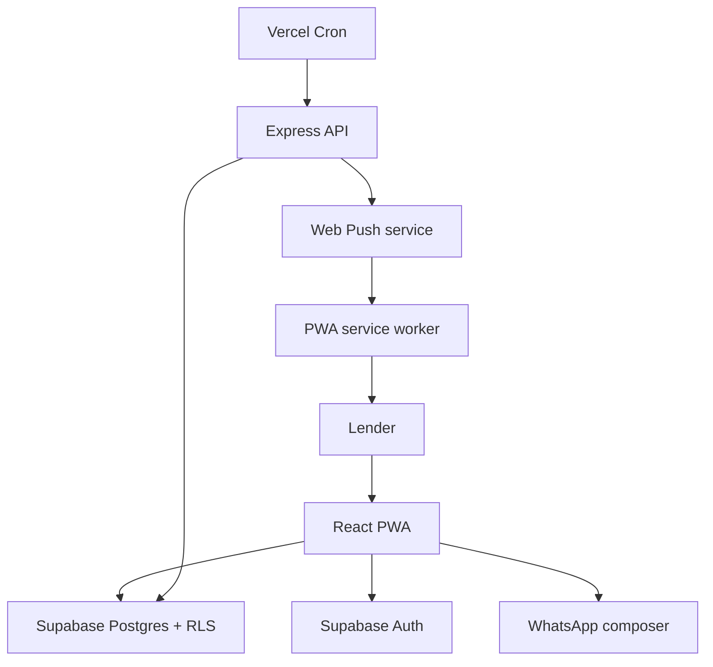

# Credit Reminder PWA — System Design

**Status:** Approved for MVP  
**Last updated:** 4 September 2026  
**Source:** GitHub Issue #1

## Product goal

Build an installable personal PWA that records money lent to friends, tracks repayments, alerts the signed-in lender when a credit is due, and prepares a WhatsApp reminder that the lender reviews and sends manually.

## Safety boundary

- Scheduled notifications go to the signed-in lender—not directly to the borrower.
- The app opens WhatsApp with a prefilled message; it never claims a message was sent or delivered.
- The borrower is identified by name and an E.164 WhatsApp phone number (for example, `+919876543210`), not a WhatsApp display name.
- Automatic WhatsApp Business API messaging is outside the MVP.

## System context



## Architecture

| Layer | Choice | Responsibility |
|---|---|---|
| Client | React + JavaScript + Vite | Dashboard, forms, payment tracking, reminder preview, WhatsApp deep link |
| UI | Tailwind CSS | Mobile-first, accessible interface |
| PWA | Web App Manifest + service worker | Installability, app-shell caching, push notification handling |
| Authentication | Supabase Auth | Email/password or magic-link session |
| Database | Supabase Postgres | Credits, payments, settings, subscriptions, reminder events |
| Authorization | Supabase Row Level Security | Every user can access only their own records |
| Server | Node.js + Express on Vercel Functions | Privileged push subscription and scheduled reminder operations |
| Scheduler | Vercel Cron | Runs the protected due-reminder job |
| Notifications | Web Push + VAPID | Notifies the lender even when the PWA is closed where browser support permits |
| WhatsApp | Click-to-chat deep link | Opens a reviewed, prefilled message for manual sending |

## Repository shape

```text
credit-reminder/
├── src/                    # React application
│   ├── components/
│   ├── features/
│   ├── pages/
│   ├── services/
│   └── shared/
├── public/                 # PWA manifest, icons, service worker assets
├── server/                 # Express app, middleware, notification services
├── api/                    # Vercel serverless entrypoint
├── supabase/migrations/    # Database schema, triggers and RLS policies
├── tests/
├── docs/
└── vercel.json
```

## Data model

| Table | Important fields | Notes |
|---|---|---|
| `profiles` | `id`, `timezone`, `default_language` | One row per authenticated user |
| `credits` | `id`, `user_id`, `borrower_name`, `phone_e164`, `principal_paise`, `paid_paise`, `borrowed_on`, `due_on`, `status`, `notes` | Amounts are stored as integer paise, never floating point |
| `payments` | `id`, `credit_id`, `user_id`, `amount_paise`, `paid_on`, `note` | Supports partial and full payments |
| `push_subscriptions` | `id`, `user_id`, `endpoint`, encrypted push keys | One user can have multiple devices |
| `reminder_events` | `id`, `credit_id`, `user_id`, `channel`, `event_type`, `created_at`, `dedupe_key` | Records “push sent” or “WhatsApp opened,” not unverified delivery |

A database trigger recalculates `credits.paid_paise` and `status` after payment changes. Common queries are indexed by `user_id`, `status`, and `due_on`.

## Core flows

### Add a credit
1. User signs in.
2. User enters borrower name, phone with country code, amount, borrowed date, due date and optional notes.
3. Client validates the form.
4. Supabase stores the record under the current user's ID.
5. RLS prevents access by every other user.

### Due-date notification
1. A protected daily cron endpoint finds open credits due today or overdue.
2. The server sends Web Push only to the owning user's registered devices.
3. A unique dedupe key prevents the same credit/date/device alert from being sent twice.
4. Tapping the notification opens the relevant credit.
5. The first MVP guarantees a due-date alert window, not an exact minute. Custom-time reminders can be added later.

### WhatsApp reminder
1. User opens a credit and chooses English or Bengali.
2. App shows the exact message and outstanding balance.
3. User taps **Open WhatsApp**.
4. App opens the normalized phone number and URL-encoded message in WhatsApp.
5. App records `whatsapp_opened`; the user still reviews and taps Send in WhatsApp.

### Payment
1. User records a positive amount no greater than the outstanding balance.
2. The payment is added to history.
3. The database recalculates paid amount and status: `open`, `partial`, or `paid`.
4. Paid credits stop generating alerts.

## Security and privacy

- Enable RLS on every exposed table and scope policies to `auth.uid()`.
- Keep the Supabase service-role key, VAPID private key and cron secret on the server only.
- Validate all API inputs again on the server.
- Require HTTPS for production notifications.
- Mask phone numbers in list views and avoid placing phone numbers or notes in push text.
- Protect the cron route and make it idempotent.
- Treat an optional local PIN as a convenience lock, not a substitute for authentication.
- Do not store WhatsApp credentials because the MVP does not use the WhatsApp Cloud API.

## MVP screens

- Sign in / create account
- Dashboard
- Add credit
- Credit list
- Credit details
- Add payment
- Reminder preview
- Reminder history
- Settings / notification permission

## MVP completion criteria

- [ ] A user can create, edit and delete only their own credit records.
- [ ] Dashboard totals correctly show lent, recovered and outstanding amounts in INR.
- [ ] Partial/full payments and due-date changes are recorded.
- [ ] Due and overdue states are correct.
- [ ] English and Bengali WhatsApp messages are previewed and opened manually.
- [ ] Due-date Web Push notifications are deduplicated.
- [ ] The PWA is installable on a supported phone.
- [ ] Empty, loading, success and error states work without mock production data.
- [ ] Automated checks pass and the app is deployed over HTTPS.

## Out of scope for the first release

Automatic WhatsApp sending, WhatsApp delivery/read receipts, interest or late-fee calculations, in-app money collection, SMS/calls, contact-book import, multi-lender teams, and native Android/iOS apps.

## Implementation roadmap

The dependency-ordered implementation work is tracked in GitHub Issues #2–#29. Issue #30 is an optional post-MVP PIN convenience lock. Each implementation issue must be completed and verified independently before the next dependent issue begins.

## Architecture decisions

1. Supabase Postgres is the source of truth; browser storage is not authoritative for financial records.
2. All monetary values are stored as integer paise.
3. Database RLS is the primary per-user authorization boundary.
4. Server-only secrets never enter the Vite client bundle.
5. Scheduled jobs notify the lender only.
6. WhatsApp sending remains a reviewed, manual user action.
7. Reminder history records only events the application can verify.
8. Offline support covers the application shell; financial mutations require a network connection.
